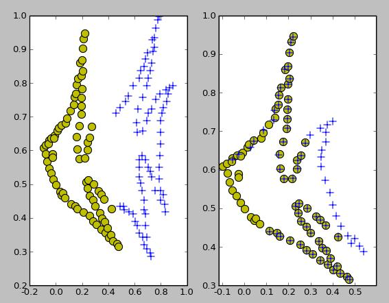
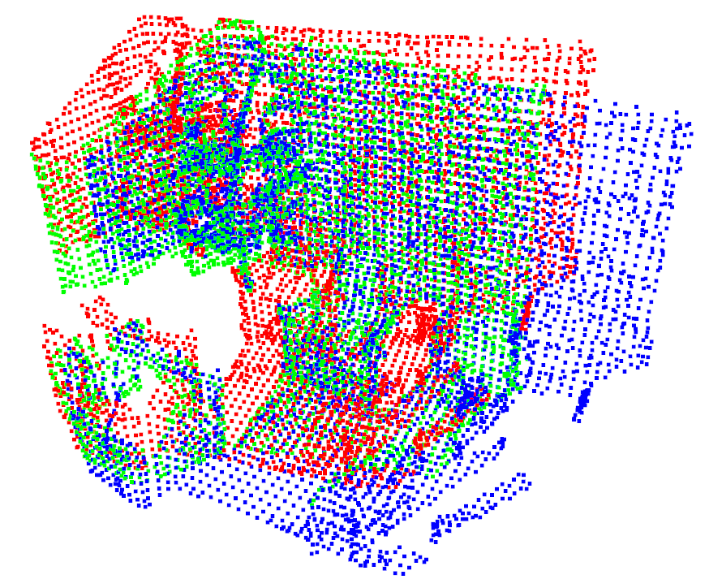
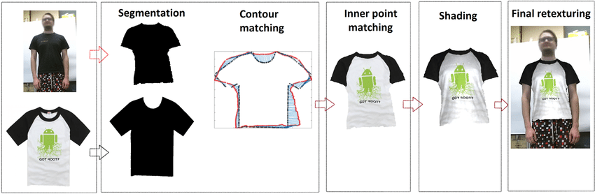
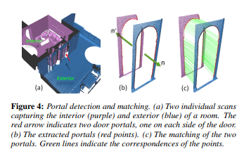
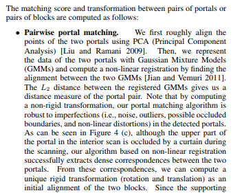
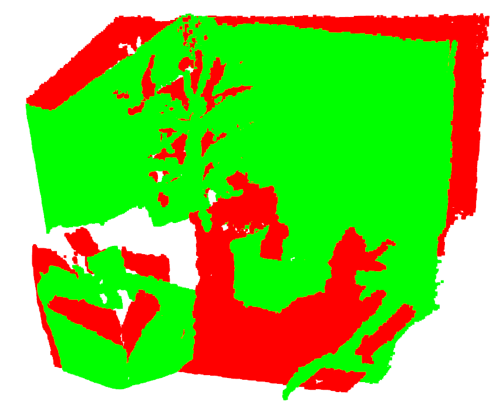

<!-- [](https://travis-ci.org/bing-jian/gmmreg) -->

Robust Point Set Registration Using Gaussian Mixture Models
======

2D, Non-Rigid  | 3D, Rigid  |
--|--|
  |    | 


## Description
This website hosts implementations of the robust point set registration framework described in the paper
 ["Robust Point Set Registration Using Gaussian Mixture Models"](https://github.com/bing-jian/gmmreg/blob/master/gmmreg_PAMI_preprint.pdf), Bing Jian and [Baba C. Vemuri](http://www.cise.ufl.edu/~vemuri), [IEEE Transactions on Pattern Analysis and Machine Intelligence, 2011, 33(8), pp. 1633-1645](https://ieeexplore.ieee.org/document/5674050).
An earlier conference version of this work,  "A Robust Algorithm for Point Set Registration Using Mixture of Gaussians, Bing Jian and Baba C. Vemuri.", appeared in the proceedings of ICCV'05. Here is the [bibtex entry](https://github.com/bing-jian/gmmreg/blob/master/gmmreg_bib.txt) for citing this work.

## Featured Applications

 * [Garment Retexturing](https://www.researchgate.net/publication/327835781_From_2D_to_3D_Geodesic-based_Garment_Matching)

 

Recently, a group of researchers from Estonia and Spain reported an interesting work of garment retexturing
in a paper titled ["From 2D to 3D geodesic-based garment matching"](https://link.springer.com/article/10.1007/s11042-019-7739-5). 
The GMM based point set registration algorithm was chosen by them for contour matching, a critical component in their
 method for garment retexturing. The following comments are taken from Section 3.2 in [their paper](https://arxiv.org/abs/1809.08064):

*"Out of available algorithms, we have chosen to
use non-rigid point set registration using Gaussian mixture
models (GMM) [21] because of its accurate fitting
under different conditions and fast execution time. Additionally,
Gaussian mixtures provide robust results even if
the shapes have different features, such as different neck
lines, hand positions and folds."*

 * [Block Assembly for Global Registration of Building Scans](https://3d.bk.tudelft.nl/liangliang/publications/2016/block_assembly/block_assembly.html)
<p align="middle">
 
  
</p>

In SIGGRAPH Asia 2016,  Yan et al. proposed a method for global registration of building scans. Our GMM based point set registration algorithm was used for pairwise portal matching in their pipeline as indicated in Section 4.3 of [their paper](http://peterwonka.net/Publications/pdfs/2016.SGA.Feilong.BlockAssembly.pdf).


 * [3-D Vessel Tree Surface Reconstruction](http://www.freepatentsonline.com/10140733.pdf)

The GMM based point set registration algorithm was used in "3-D Vessel Tree Surface Reconstruction", a patent 
(United States Patent 10140733) filed by researchers at Siemens Corporate Research in Princeton, as shown in 
Eq(2) and Eq(16).

## A Unified Framework
The basic idea of the proposed point set registration framework is to *1) represent the two point sets by continuous distributions, in particular, Gaussian mixture models; 2) and then minimize the distance between the two distributions by moving one towards another.*
Interestingly, several previous well-known point set registration algorithms can all be re-formulated using this unified framework, including:

 * [[Iterative Closest Point (ICP)]](https://en.wikipedia.org/wiki/Iterative_closest_point) Besl, Paul J.; N.D. McKay (1992). 
"A Method for Registration of 3-D Shapes". IEEE Transactions on Pattern Analysis and Machine Intelligence. 14 (2): 239–256.

 * [[TPS-RPM]](https://www.cise.ufl.edu/~anand/students/chui/research.html) Haili Chui and Anand Rangarajan,
A new point matching algorithm for non-rigid registration,
Computer Vision and Image Understanding, 2003, 89(2-3), pp. 114-141.

 * [[KC-Reg]](http://www.cs.cmu.edu/~ytsin/KCReg/) Yanghai Tsin and Takeo Kanade,
A Correlation-Based Approach to Robust Point Set Registration,
ECCV (3) 2004: 558-569. 

 * [GMMREG-L2] Bing Jian and Baba C. Vemuri,
A Robust Algorithm for Point Set Registration Using Mixture of Gaussians,
ICCV 2005, pp. 1246-1251.

 * [[Coherent Point Drift (CPD)]](https://arxiv.org/pdf/0905.2635.pdf) Andriy Myronenko, Xubo B. Song, Miguel A. Carreira-Perpinan,
Non-rigid Point Set Registration: Coherent Point Drift,
NIPS 2006, pp. 1009-1016. 

Please see Fig 3. in [Jian&Vemuri PAMI'11](https://github.com/bing-jian/gmmreg/blob/master/gmmreg_PAMI_preprint.pdf) on how those methods can be reformulated under this unified framework by choosing different statistical divergence functions. 

For a growing list of recent work on point set registration/matching, please refer to [this actively maintained github repo](https://github.com/gwang-cv/Point-Set-Matching-Registration-Material).

## How to compile and test the C++ code

* Build the C++ code using CMake

To build the execuatables from the source code, please use [CMake](http://www.cmake.org/). Please note that
the current C++ implementation depends on [vxl/vnl](http://vxl.sourceforge.net/) 
for doing matrix computation and numerical optimization.

* Run registration using the executable and a configuration file

The executable (named "gmmreg\_demo") takes a configuration file (in INI format) and a tag string from command line. For more on usage, please check [this file](https://github.com/bing-jian/gmmreg/blob/master/C%2B%2B/gmmreg_api.cpp). For examples of config INI file, please check [this folder](https://github.com/bing-jian/gmmreg/tree/master/data). 

* Test non-rigid registration.
```
git clone https://github.com/bing-jian/gmmreg.git --recursive
cd C++
mkdir build && cd build
cmake -DCMAKE_BUILD_TYPE=Release ..
make
cd ../../data
../C++/build/gmmreg_demo ./face.ini tps_l2
../C++/build/gmmreg_demo ./fish_full.ini tps_l2
../C++/build/gmmreg_demo ./fish_partial.ini tps_l2
```

* Test 3D rigid registration on a 3D scan dataset.
    * [This Python script](https://github.com/bing-jian/gmmreg/blob/master/expts/dragon_expts.py)
 can be used to reproduce the results described in Section 6.1 of [Jian&Vemuri PAMI'11 paper](https://github.com/bing-jian/gmmreg/blob/master/gmmreg_PAMI_preprint.pdf)
using the [Stanford dragon\_stand dataset](http://graphics.stanford.edu/data/3Dscanrep/).

* Test 3D rigid registration on a RGB-D dataset.
    * [This Python script](https://github.com/bing-jian/gmmreg/blob/master/expts/lounge_expts.py)
 can be used to register depth frames in the [Stanford lounge dataset](http://qianyi.info/scenedata.html).
 Please see section below for results.

## Results of running GMMReg-Rigid on [Stanford lounge dataset](http://qianyi.info/scenedata.html)

* Example:  Registering 2nd frame (source, in red) and 12th frame (target, in green), the transformed source is in blue. 

Before| Registration | After|
--|------|---------------|
  |   |   | 

```
Transformation estimated by gmmreg:
[[ 0.979206  -0.0376796  0.199341  -0.174986 ]
 [ 0.0348325  0.999235   0.0177716  0.106985 ]
 [-0.199858  -0.0104585  0.979769  -0.191445 ]
 [ 0.         0.         0.         1.       ]]
Transformation from ground truth:
[[ 0.98046985 -0.0365099   0.19324962 -0.16860252]
 [ 0.03337988  0.99925376  0.01942979  0.10915275]
 [-0.19381476 -0.01259967  0.9809579  -0.19450066]
 [ 0.          0.          0.          1.        ]]
('pose difference (in degrees) before alignment:', 11.379813087519903)
('pose difference (in degrees) after alignment:', 0.37620688052421786)
```

* Test environment and setting
    * CPU: Intel(R) Core(TM) i7-6850K CPU @ 3.60GHz
    * OS: Ubuntu 16.04
    * Algorithm:  GMMReg-Rigid (3D rotation parametrized using quaternion); Gauss transform approximated using k-d tree.
    * C++: Compiled with OpenMP support and -O3 optimization flag.
    * Point cloud downsampling: using voxel\_down\_sample(voxel\_size=0.065) from [Open3D](http://www.open3d.org/docs/tutorial/Basic/pointcloud.html#voxel-downsampling)
    * Multi-scale configuration and optimization solver parameters are specified [here](https://github.com/bing-jian/gmmreg/blob/master/expts/lounge.ini)
    * Note that error in rotation estimation is measured as angle discrepancy in degrees, using a formula described in http://www.boris-belousov.net/2016/12/01/quat-dist/)


* Results on 295 pairs (every 5 frames from the first 300 frames, e.g. registering i-th and (i+5)-th for i from 1 to 295). 
The avg pair-wise pose difference among these 295 pairs is ~4.84 degree.  
The median angle error against the ground truth is ~0.6 degree and the median fps is ~8 with Intel i7-6850K CPU.


Metric| Avg | Min | Max | Median |
--|------|-----|-----|------|
Rotation angle error (in degrees)  | 0.96 | 0.07 | 9.08| 0.60 |
Run time per pair (in milliseconds)| 120.14 | 47.09 | 413.48 | 116.62 |

* Results on 2995 pairs (every 5 frames from the entire 3000 frames, e.g. registering i-th and (i+5)-th for i from 1 to 2995). 
The avg pair-wise pose difference among these 295 pairs is ~5.43 degree.
The median angle error against the ground truth is ~0.4 degree and the median fps is ~16 fps with Intel i7-6850K CPU.
 
Metric| Avg | Min | Max | Median | 
--|------|-----|-----|------|
Rotation angle error (in degrees)  | 0.65 | 0.01 | 19.49| 0.41 |
Run time per pair (in milliseconds)| 76.18 | 18.27 | 508.25 | 60.06 |

* Note that always downsampling to ~5000 points (instead of downsampling using a fixed voxel size) leads to less mistakes (much smaller max angle error with similar averge/median angle errors) at the cost of running longer time (about twice time as reported above).
